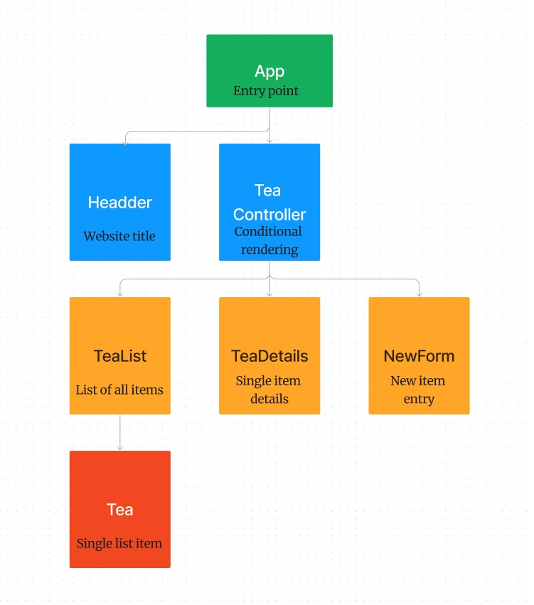

# Tea Shop

#### By _**Dominik Magic**_

#### _A web application for tracking an selling tea_<p>&nbsp;</p>  

## Technologies Used

* React
* JavaScript
* Tailwind
* HTML
* CSS
* Node.js
* webpack

## Description

A web application built for purpose of demonstrating Conditional Rendering with React, in combination with local and shared state. The application will display the list of all tea in the inventory and upon clicking on a tea, it will display details for the selected tea, givin the full Read capability. The application also has the option to Create new item, and Update the state of existing items by decresing quantity once the item is sold.

## Component Diagram




## Setup/Installation Requirements

* Clone this repo to your workspace.
* Navigate to the top level of the directory.
* In the root directory of the project, run this command to install all packages listed in the package.json:
```
$ npm install
```
* Then, to build and serve the project, run: 
```
$ npm run start
```


## Known Bugs

* No known bugs at the moment

## License

[MIT](https://choosealicense.com/licenses/mit/)

Copyright (c) _2023_ _Dominik Magic_

Permission is hereby granted, free of charge, to any person obtaining a copy
of this software and associated documentation files (the "Software"), to deal
in the Software without restriction, including without limitation the rights
to use, copy, modify, merge, publish, distribute, sublicense, and/or sell
copies of the Software, and to permit persons to whom the Software is
furnished to do so, subject to the following conditions:

The above copyright notice and this permission notice shall be included in all
copies or substantial portions of the Software.

THE SOFTWARE IS PROVIDED "AS IS", WITHOUT WARRANTY OF ANY KIND, EXPRESS OR
IMPLIED, INCLUDING BUT NOT LIMITED TO THE WARRANTIES OF MERCHANTABILITY,
FITNESS FOR A PARTICULAR PURPOSE AND NONINFRINGEMENT. IN NO EVENT SHALL THE
AUTHORS OR COPYRIGHT HOLDERS BE LIABLE FOR ANY CLAIM, DAMAGES OR OTHER
LIABILITY, WHETHER IN AN ACTION OF CONTRACT, TORT OR OTHERWISE, ARISING FROM,
OUT OF OR IN CONNECTION WITH THE SOFTWARE OR THE USE OR OTHER DEALINGS IN THE
SOFTWARE.